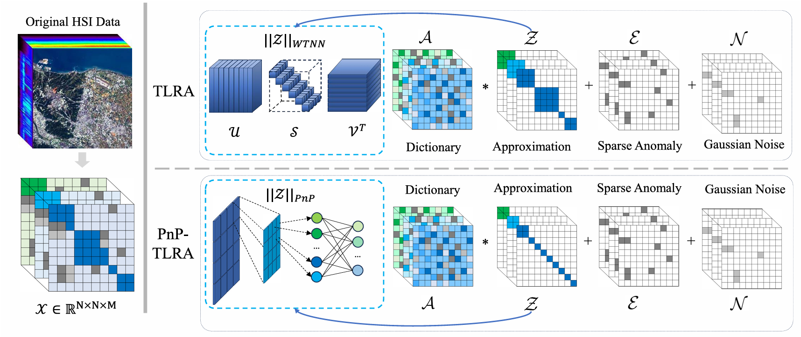

# PnP-TLRA

The code in this toolbox implements ["Tensor Low-Rank Approximation via Plug-and-Play Priors for Anomaly Detection in Remote Sensing Images"](https://ieeexplore.ieee.org/document/10935754) by <i>J. Liu, M. Feng, X. Xiu, X. Zeng, J. Zhang</i>.

### Testing
Directly run demo.m for reproduction.

### Citation
Please give credits to this paper if this code is useful and helpful for your research.

     @article{liu2025tensor,
      title     = {Tensor Low-Rank Approximation via Plug-and-Play Priors for Anomaly Detection in Remote Sensing Images},
      author    = {Liu, Jingjing and Feng, Manlong and Xiu, Xianchao and Zeng, Xiaoyang and Zhang, Jianhua},
      journal   = {IEEE Transactions on Instrumentation and Measurement},
      year      = {2025},
      volume    = {74},
      pages     = {1-14},
      publisher = {IEEE}
     }

